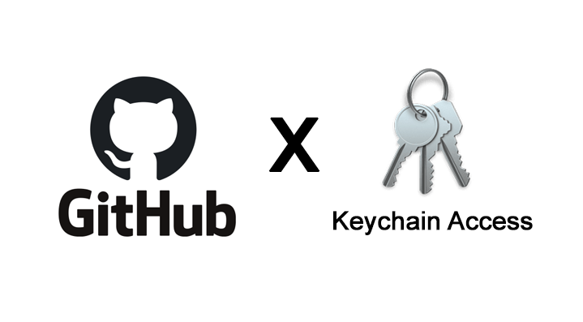

# 왜 깃헙 repo에 푸쉬가 안되지?

```
#Tag

git, push, config, user.name, keychain access, github, push permission, 403, permission denied, error, mac
```



<br />

<br />

## 🎉 깃헙 repo에 push를 하는 과정에서 permission denied되었다...

<br />

<br />

> ### **Permission denied..**

<br />

새로운 마음으로 타입스크립트를 공부하려고 깃헙에 저장소를 만들고 클론을 받았다.<br />
가볍게 리드미를 작성해주고 push를 하려는데... 시작부터 이런다고..? 😳

<br />


처음에는 깃헙 로그인이 잘못 되어있나? 라는 생각이 들어서 아이디를 바꿔가면서 해봤는데 역시나 실패ㅋㅋ<br />
바로 'github push error', 'git push permission denied' 같은 키워드로 폭풍 검색을 진행했다.

<br />

<br />

> ### **Keychain Access💆**
>
> <br />

그래서 찾아낸 키워드가 바로 Keychain access<br />
찾다 보니 예전에 이런 비슷한 케이스를 겪었던게 불현듯 기억났다..<br /> 처음 부트 캠프 초반이었는데, 자리 이동이 있어서 컴퓨터를 바꿨는데 기존 사용자 정보가 남아있어서 깃이 나를 거부했던 것을ㅋㅋㅋ

<br />

<br />

> ### **Finder > Applications > Utilities > Keychain Access**

<br />

맥을 처음 사용해본지도 언 6개월 ... 지금은 맥도 잘 모르고 윈도우도 어색해져버린 이상한 상황이 되어버렸다. '분명히 어디서 본 것 같은데...' 중얼거리면서 한참 찾았다 ㅋㅋㅋ<br />
실행 시켜서 오른쪽 상단에서 git을 검색하면 나에게 필요한 깃에 관련된 유저정보를 모아 볼 수 있다😏

<br />


~~저 4개 중에 1개 같은데 ...~~ 잘못 건드렸다 일이 커진적이 한 두번이 아니기 때문에 ㅋㅋㅋㅋ<br />
조금 더 검색해서 2가지 방법이 있다는 걸 믿을 만한 곳에서 발견했다! ~~(글 하단 링크 참고)~~

<br />

> ### **$ git credential-osxkeychain erase**

<br />

2개 방법 중 하나는 keychain access에서 직접 깃헙 관련 internet password파일을 지우는 것이고, 다른 하나는 터미널에서 커맨드 라인을 이용하는 방법이었다.<br />
<br />
내가 가지고 있는 4개 중에 뭘 지워야되는지 불확실 해서 하는 커맨드 라인을 이용했다.
터미널 키고, 내가 작업하는 폴더에 가서 **_git credential-osxkeychain erase_**<br />
그리고 이어서 **_host=github<span>.</span>com_** 과 **_protocol=https_** 를 입력🔑

<br />


(아마 한번 중간에 실패해서, 2개 지워지고 1개 새로 생성됨.)

<br />

<br />

> ### **[Press Return]이 뭐지..**

<br />

아래 명령어를 순서 대로 입력하면 아무것도 터미널에 나타나지 않는다. <br />
[Press Return]이 뭔지 몰라서 중간에 터미널을 한번 종료했었는데 알고 보니 그냥 엔터치란 소리😈😈

<br />

```
$ git credential-osxkeychain erase
host=github.com
protocol=https
> [Press Return]
```

<br />

<br />

> ### **그럼 마지막으로 다시 push를 해볼까?**

<br />

아직 끝난게 아니었다! *git push origin main*을 실행시키면 마지막으로 새로운 유저의 깃헙 아이디와 패스워드를 물어본다.

<br />


깃헙 회원가입 때 사용한 이메일과 비밀번호를 입력하면 끝!

<br />

<br />

### **Reference**

- https://docs.github.com/en/github/using-git/updating-credentials-from-the-macos-keychain
